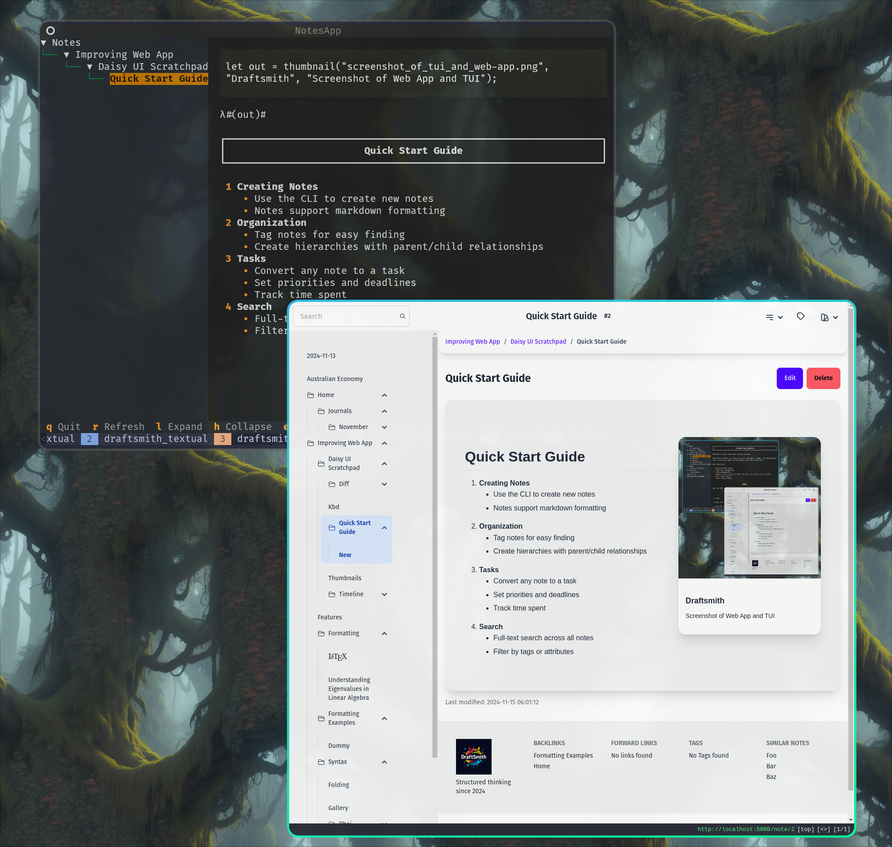

# Draftsmith

<p></p>

Meta Repository for Draftsmith.

## What is Draftsmith?

<p></p>
<p></p>


Draftsmith is a modern note-taking and task management system built with a focus on performance, type safety, and flexibility. It allows you to organize your thoughts, tasks, and knowledge in a hierarchical structure while maintaining relationships between different pieces of information through tags and parent-child relationships.

Most importantly, Draftsmith is hackable! It allows both client side scripting in Javascript with no HTML sanitization and server side scripting in [Rhai](https://rhai.rs/book/about/index.html) (with built in functions registed directly from the server). This flexibility makes a great thinking space to tinker with ideas and automate workflows.

See the [Documentation](https://ryangreenup.github.io/draftsmith_docs/) for more information.


## Installation

TODO

## Usage

TODO


## Screenshots

These screenshots are from the Flask application, I'm actively developing an Axum web app, PyQt application and hopefully something in Iced or Tauri (`#TODO`). There are `fzf` / `skim` scripts to open notes in `$EDITOR` (WIP).

<details closed><summary>

Screenshots
</summary>


</details>


## Development

PRs are welcome! Please follow the guidelines below:

### Rust
Make sure of the following:

- `cargo check`
- `cargo clippy`
- `cargo test`
    - Every PR should have tests

### Python

Make sure of the following:

- `black .` or `ruff format`
- `ruff check`

Python bindings should be updated to reflect the Rust Client.

## Architecture

Draftsmith follows a unique architectural approach:
- Core logic is implemented in Rust (backed by Postgresql), so: strong type safety, memory safety, and high performance
- A REST API exposes this functionality, this allows flexible integrations (with officially maintained Python Bindings)
- Client applications (GUI, CLI, etc.) can be written in any language while benefiting from a stable, well-defined and performant backend
    - An official CLI is provided in Rust

This separation allows:
- Core business logic to remain fast and reliable
- GUI development to use more flexible languages like Python or TypeScript
- CLI tools and aliases can be created easily.
- Type safety and correctness to be maintained across all interfaces

## Inspiration

I built Draftsmith because I used to love PHP scripts on Dokuwiki, I wanted a markdown and Rust based version of that with a REST API so I could connect it to Vim and Emacs. Most importantly I wanted to be able to create macros like [Typst](https://typst.app/docs/) automate things (easily) like this:

```rust
let g = gallery(
    "All PNG Files",
    list_assets(`*.png`));
g
```

Which gives me a gallery like this:

<details closed><summary>

HTML
</summary>

```html

<div class="max-w-4xl mx-auto p-6 border border-gray-200 rounded-lg shadow-md">
<h2 class="text-2xl font-bold">All PNG Files</h2>
    <div class="grid grid-cols-1 sm:grid-cols-2 md:grid-cols-3 lg:grid-cols-4 gap-4">
    <div></div>
    <div></div>
    <div></div>
    <div></div>
    <div></div>
    <div></div>
    <div></div>
    <div></div>
    <div></div>
    <div></div>
    <div></div>
    </div>
</div>
```
</details>


<details closed><summary>

Screenshot
</summary>


<p></p>
</details>


## Use Case

If you're looking for a note-taking system that allows you to:

- Write notes in markdown
- Organize notes in a hierarchical structure
- Write in HTML, CSS, Javascript, and client-side Rhai (with bindings back to the database WIP)
- Connect to your notes via a REST API
- Store everything in a Postgresql database

Then Draftsmith is for you!

However, if you're looking for a note-taking system that:

- Allows you to write in WYSIWYG
- Is locked down and designed for multiple untrusted users

Then Draftsmith is not for you.

## Features

## License

GPL License
